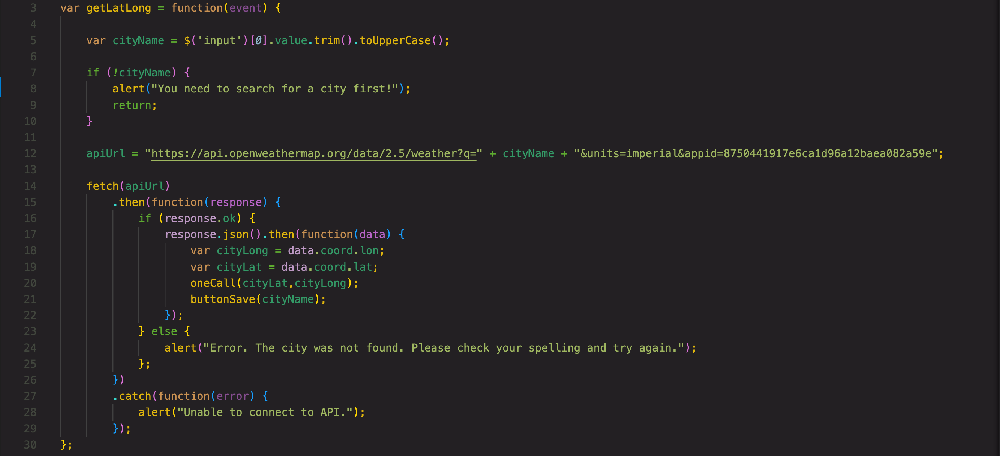

# oh-the-weather-outside-is
## Description

## Built With:
* HTML
* CSS
    * [Foundation](https://get.foundation/sites/docs/) By Zurb
* JavaScript
    * [JQuery](https://api.jquery.com/)

## Key Features:
### Serve-Side APIs

### Switch Case Fall Through

### Using .filter() and returning information

View the live page [here!](https://ahudg.github.io/oh-the-weather-outside-is/)

## Contributions
Made by Andrew Hudgins :)